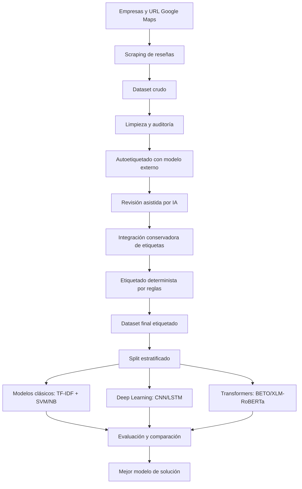

# SECCIÓN III - METODOLOGÍA

## 3.1 Contexto de la solución y adopción de DSRM

La solución propuesta aborda la clasificación multiclase de sentimiento en reseñas de consumidores peruanos publicadas en Google Maps, considerando cinco niveles de polaridad: `muy negativo`, `negativo`, `neutral`, `positivo` y `muy positivo`. El problema se enmarca en minería de datos aplicada al análisis de opinión, donde el objetivo es transformar comentarios no estructurados en una variable categórica útil para identificar patrones de satisfacción e insatisfacción frente a empresas de distintos rubros. Para el diseño de la propuesta se adopta la metodología DSRM, Design Science Research Methodology, propuesta por Peffers et al. (2007), porque permite construir y evaluar un artefacto computacional orientado a resolver un problema práctico. En este proyecto, el artefacto corresponde a un pipeline de datos y modelado compuesto por scraping, limpieza, etiquetado, partición estratificada, entrenamiento, evaluación y comparación de modelos. Bajo DSRM, la identificación del problema se relaciona con la necesidad de clasificar reseñas en español peruano; los objetivos de solución se traducen en construir un dataset confiable y entrenar modelos comparables; el diseño y desarrollo se materializa en los componentes del pipeline; la demostración se realiza sometiendo el conjunto de datos a los modelos; la evaluación se efectúa mediante métricas de clasificación; y la comunicación se concreta en los reportes, tablas y resultados presentados.

## 3.2 Procedencia del conjunto de datos

El conjunto de datos procede de reseñas públicas de Google Maps asociadas a empresas peruanas. La recolección se realizó mediante scraping controlado, tomando como entrada el archivo `data/raw/empresas.csv`, el cual contiene empresas, sedes, rubros y URL de Google Maps. El scraper genera como salida `data/raw/dataset_consumidores_peru.csv`, con 4800 reseñas iniciales. Cada registro conserva el comentario textual, la empresa evaluada, la sede, el rubro, la calificación en estrellas, una etiqueta inicial derivada de las estrellas, la fecha relativa de la reseña y la URL de origen.

### Estructura del conjunto de datos original

| Campo | Descripción | Uso en la solución |
|---|---|---|
| `comentario` | Texto original escrito por el consumidor. | Variable principal para el análisis de sentimiento. |
| `empresa` | Nombre de la empresa evaluada. | Contexto descriptivo y trazabilidad. |
| `sede` | Sede o ubicación de la empresa. | Contexto geográfico/comercial. |
| `rubro` | Sector de actividad de la empresa. | Segmentación descriptiva. |
| `estrellas` | Calificación numérica de 1 a 5. | Señal débil inicial para etiquetado. |
| `sentimiento_estrella` | Sentimiento derivado de la cantidad de estrellas. | Etiqueta inicial distante. |
| `fecha_resena` | Fecha relativa publicada por Google Maps. | Referencia temporal. |
| `url` | Enlace de procedencia de la reseña. | Trazabilidad del origen. |

## 3.3 Arquitectura de la solución basada en componentes

La arquitectura propuesta se organiza como un pipeline modular. Cada componente recibe una entrada definida, aplica una transformación o evaluación y produce archivos intermedios o finales que permiten auditar el proceso completo.



### Funcionamiento de los componentes

| Componente | Entrada | Funcionamiento | Salida |
|---|---|---|---|
| Scraping | `data/raw/empresas.csv` | Extrae reseñas de Google Maps por empresa y sede, con pausas y control anti-bloqueo. | `data/raw/dataset_consumidores_peru.csv` |
| Limpieza y auditoría | Dataset crudo | Normaliza texto, valida estrellas, detecta comentarios cortos, registros sin contenido alfabético e inconsistencias. | `dataset_consumidores_peru_limpio.csv` y reportes de limpieza. |
| Autoetiquetado | Dataset limpio | Usa un modelo externo de sentimiento como segunda señal frente a las estrellas. | `dataset_consumidores_peru_etiquetado.csv` |
| Revisión asistida por IA | Casos ambiguos | Prioriza registros con contradicción o baja confianza para revisión focalizada. | Archivos de revisión y etiquetas IA. |
| Integración conservadora | Etiquetas automáticas e IA | Acepta etiquetas cuando existe consenso o alta confianza, priorizando pureza sobre cobertura. | `dataset_consumidores_peru_etiquetado_final.csv` |
| Etiquetado por reglas | Dataset final parcial | Aplica reglas deterministas sobre estrellas, probabilidad neutral y probabilidad positiva. | Dataset final actualizado y validación de reglas. |
| Split estratificado | Dataset final etiquetado | Divide los datos preservando la distribución de clases. | `train.csv`, `valid.csv`, `test.csv` |
| Modelado | Splits de datos | Entrena modelos clásicos, redes neuronales y transformers con estrategias de balanceo. | Reportes, matrices de confusión y modelos entrenados. |
| Comparación | Métricas de modelos | Unifica resultados con F1-macro, accuracy, F1 ponderado y balanced accuracy. | Comparación global y selección del mejor modelo. |

## 3.4 Preprocesamiento, transformación y reducción

El preprocesamiento se diseñó para conservar la información semántica del comentario y, al mismo tiempo, generar una representación adecuada para los algoritmos. En la etapa de limpieza se mantuvieron 4800 registros, sin duplicados exactos removidos, sin comentarios vacíos, sin estrellas inválidas y sin sentimientos inconsistentes. Se identificaron 156 comentarios con menos de tres palabras, 3 registros sin contenido alfabético y 165 filas marcadas para revisión.

### Criterios de limpieza y auditoría

| Criterio | Resultado |
|---|---:|
| Filas iniciales | 4800 |
| Filas finales tras limpieza | 4800 |
| Duplicados exactos removidos | 0 |
| Comentarios vacíos | 0 |
| Estrellas inválidas | 0 |
| Sentimientos inconsistentes | 0 |
| Comentarios cortos, menos de 3 palabras | 156 |
| Sin contenido alfabético | 3 |
| Filas para revisión | 165 |

### Transformaciones aplicadas

| Transformación | Descripción | Resultado esperado |
|---|---|---|
| Normalización textual | Conversión a una forma uniforme para modelado, eliminación de ruido y estandarización de espacios/signos. | Campo `texto_modelo`. |
| Conservación del texto limpio | Mantiene una versión natural del comentario para modelos transformer. | Campo `comentario_limpio`. |
| Cálculo de longitud | Número de caracteres del comentario. | Campo `longitud_caracteres`. |
| Conteo de palabras | Número de palabras útiles. | Campo `cantidad_palabras`. |
| Validación de estrellas | Comprueba que la calificación pertenezca al rango esperado. | Campo `estrellas_validas`. |
| Señal débil por estrellas | Traduce 1-5 estrellas a sentimiento inicial. | Campo `sentimiento_estrella`. |
| Señal de modelo externo | Obtiene polaridad y probabilidades `NEG`, `NEU`, `POS`. | Campos `sentimiento_modelo`, `prob_neg`, `prob_neu`, `prob_pos`. |
| Integración de etiquetas | Combina estrellas, modelo externo, IA y reglas. | Campo `sentimiento_final`. |

### Aplicación de reducción

La reducción se aplicó en dos niveles. Primero, a nivel de registros, se excluyeron del modelado los casos sin etiqueta final confiable o sin texto utilizable. El dataset original tenía 4800 filas; 4180 contaban con etiqueta final consolidada y 4177 fueron usadas para modelado. Segundo, a nivel de representación, los modelos clásicos transformaron el texto mediante TF-IDF con unigramas y bigramas, reduciendo el texto crudo a una matriz numérica ponderada por frecuencia e importancia. En el caso de transformers, la reducción semántica se realizó mediante tokenización sub-palabra y representaciones contextuales internas del modelo.

### Reglas deterministas de recuperación de etiquetas

| Regla | Condición | Etiqueta asignada |
|---|---|---|
| R1 | 4 o 5 estrellas, modelo `NEU`, `prob_neu >= 0.60` | `neutral` |
| R2a | 1 estrella, modelo `NEU`, `prob_pos < 0.25` | `muy negativo` |
| R2b | 2 estrellas, modelo `NEU`, `prob_pos < 0.25` | `negativo` |

Estas reglas recuperaron 390 etiquetas adicionales, principalmente neutrales y negativas, con 93% de acuerdo frente a etiquetas IA existentes. El residuo sin etiqueta confiable fue de 620 registros.

## 3.5 Estructura final del conjunto de datos

El dataset final se encuentra en `data/processed/dataset_consumidores_peru_etiquetado_final.csv`. Integra columnas originales, columnas de limpieza, variables auxiliares de auditoría, señales de modelos externos, etiquetas revisadas e indicadores de reglas.

| Grupo de campos | Campos principales | Función |
|---|---|---|
| Identificación y origen | `comentario`, `empresa`, `sede`, `rubro`, `fecha_resena`, `url` | Trazabilidad de la reseña. |
| Calificación original | `estrellas`, `sentimiento_estrella` | Señal débil inicial basada en estrellas. |
| Texto procesado | `comentario_limpio`, `texto_modelo` | Entrada para transformers y modelos clásicos/deep learning. |
| Auditoría textual | `longitud_caracteres`, `cantidad_palabras`, `comentario_corto`, `sin_contenido_alfabetico` | Control de calidad del texto. |
| Auditoría de consistencia | `duplicado_global`, `duplicado_empresa_sede`, `estrellas_validas`, `sentimiento_esperado`, `sentimiento_consistente`, `requiere_revision` | Validación de registros y detección de casos dudosos. |
| Modelo externo | `sentimiento_modelo`, `polaridad_modelo`, `confianza_modelo`, `prob_neg`, `prob_neu`, `prob_pos` | Segunda señal automática de sentimiento. |
| Etiquetado final | `sentimiento_final`, `sentimiento_final_provisional`, `confianza_etiqueta`, `motivo_revision_etiqueta`, `sentimiento_final_origen` | Variable objetivo y trazabilidad de la etiqueta. |
| Revisión IA | `sentimiento_ia`, `confianza_ia`, `justificacion_ia`, `usar_etiqueta_ia`, `sentimiento_ia_neutral`, `confianza_ia_neutral`, `usar_etiqueta_ia_neutral` | Integración de revisión asistida. |
| Reglas | `regla_aplicada` | Identifica si una etiqueta fue recuperada por reglas deterministas. |

### Distribución final de clases

| Clase | Cantidad |
|---|---:|
| `muy positivo` | 1407 |
| `muy negativo` | 1054 |
| `positivo` | 647 |
| `neutral` | 639 |
| `negativo` | 433 |
| Total con etiqueta final | 4180 |

## 3.6 Fundamentación de algoritmos utilizados

La selección de algoritmos se fundamenta en antecedentes del análisis de sentimiento y clasificación de texto. Naive Bayes ha sido utilizado ampliamente como línea base por su simplicidad, eficiencia y buen desempeño en texto representado por bolsa de palabras, como muestran McCallum y Nigam (1998) y Pang, Lee y Vaithyanathan (2002). SVM es una técnica robusta para clasificación de texto de alta dimensionalidad, destacada por Joachims (1998), especialmente cuando se combina con TF-IDF. En aprendizaje profundo, CNN para texto fue popularizada por Kim (2014), al capturar patrones locales de n-gramas, mientras que LSTM se fundamenta en Hochreiter y Schmidhuber (1997) para modelar dependencias secuenciales. Finalmente, los transformers, introducidos por Vaswani et al. (2017) y consolidados en BERT por Devlin et al. (2019), permiten generar representaciones contextuales superiores. Para español, BETO, propuesto por Cañete et al. (2020), y XLM-RoBERTa, de Conneau et al. (2020), son alternativas adecuadas para tareas de lenguaje natural en español y escenarios multilingües.

## 3.7 Exploración y selección del mejor algoritmo

Se exploraron tres familias de algoritmos sobre los mismos datos y con criterios de evaluación comparables. Los modelos clásicos incluyeron SVM y Naive Bayes con TF-IDF; los modelos de deep learning incluyeron CNN y LSTM con embeddings entrenables; y los modelos transformer incluyeron BETO y XLM-RoBERTa con ajuste fino y pérdida ponderada por clase. La métrica principal para seleccionar el mejor modelo fue F1-macro, porque el conjunto de datos presenta desbalance entre clases y esta métrica otorga igual importancia a cada categoría.

| Familia | Modelo | Estrategia | F1-macro test | Accuracy test | Balanced accuracy test |
|---|---|---|---:|---:|---:|
| Transformer | XLM-RoBERTa | Class weight | 0.6498 | 0.7033 | 0.6509 |
| Transformer | BETO | Class weight | 0.6328 | 0.6826 | 0.6298 |
| Deep learning | LSTM | Class weight | 0.5247 | 0.5917 | 0.5222 |
| Clásico | Naive Bayes | SMOTE | 0.5207 | 0.5742 | 0.5218 |
| Clásico | SVM | Balanced | 0.5203 | 0.6188 | 0.5201 |
| Deep learning | CNN | Base | 0.5102 | 0.6013 | 0.5113 |
| Clásico | SVM | Base | 0.5066 | 0.6284 | 0.5101 |
| Clásico | SVM | SMOTE | 0.5060 | 0.5917 | 0.5042 |
| Deep learning | CNN | Class weight | 0.4981 | 0.5630 | 0.4994 |
| Deep learning | LSTM | Base | 0.4969 | 0.5821 | 0.5017 |
| Clásico | Naive Bayes | Base | 0.3062 | 0.5821 | 0.3969 |

El mejor algoritmo fue XLM-RoBERTa con ponderación de clases, al obtener el mayor F1-macro en prueba, 0.6498, y la mayor exactitud, 0.7033. Esto indica que las representaciones contextuales multilingües capturan mejor la variabilidad del lenguaje usado por consumidores peruanos que los modelos basados únicamente en frecuencias o embeddings entrenados desde cero.

## 3.8 Detalle del modelo principal: XLM-RoBERTa con ponderación de clases

El componente central de la solución es el modelo transformer XLM-RoBERTa ajustado para clasificación multiclase. Este modelo transforma cada comentario en una secuencia de tokens sub-palabra y calcula representaciones contextuales mediante mecanismos de auto-atención. A diferencia de TF-IDF, que representa el texto como frecuencias ponderadas, XLM-RoBERTa incorpora el contexto de cada palabra según su relación con las demás palabras del comentario. Esto es importante en reseñas de consumidores, donde expresiones como ironía, quejas mezcladas con elogios o términos propios del español peruano pueden alterar la polaridad del texto.

Matemáticamente, el transformer calcula atención escalada mediante la expresión:

```text
Attention(Q, K, V) = softmax((QK^T) / sqrt(d_k)) V
```

Donde `Q` representa consultas, `K` claves, `V` valores y `d_k` la dimensión de las claves. Este mecanismo permite que el modelo asigne mayor peso a las partes del comentario que explican la polaridad. Luego, una capa de clasificación convierte la representación contextual final en probabilidades para las cinco clases de sentimiento. La ponderación de clases ajusta la función de pérdida para penalizar más los errores en clases minoritarias, como `negativo`, `neutral` y `positivo`, evitando que el modelo se sesgue únicamente hacia las clases mayoritarias `muy positivo` y `muy negativo`.

# SECCIÓN IV - RESULTADOS Y ANÁLISIS DE IMPACTO CON RESPECTO A OTRAS PROPUESTAS

## 4.1 Conjunto de datos y división de entrenamiento, validación y prueba

El conjunto de datos original contiene 4800 reseñas. Luego del proceso de etiquetado e integración, 4180 reseñas cuentan con sentimiento final consolidado y 4177 se utilizaron efectivamente para modelado. La división implementada en el proyecto fue estratificada y quedó en 70% entrenamiento, 15% validación y 15% prueba. Esta distribución permite entrenar, ajustar y evaluar con conjuntos independientes, preservando la proporción de clases.

| Partición usada | Cantidad | Proporción |
|---|---:|---:|
| Entrenamiento | 2923 | 69.98% |
| Validación | 627 | 15.01% |
| Prueba | 627 | 15.01% |
| Total usado en modelado | 4177 | 100% |

Para expresar la división solicitada de entrenamiento 80% y prueba 20%, sobre 4177 registros equivaldría aproximadamente a 3342 registros para entrenamiento/desarrollo y 835 para prueba. Si luego el bloque de entrenamiento/desarrollo se subdivide en 70% entrenamiento y 30% validación, se obtendrían aproximadamente 2339 registros de entrenamiento y 1003 de validación. Sin embargo, los resultados reportados en este proyecto corresponden a la partición real ya generada en el repositorio: 70/15/15.

### Distribución estratificada por clase

| Clase | Train | Valid | Test |
|---|---:|---:|---:|
| `muy positivo` | 985 | 211 | 211 |
| `muy negativo` | 737 | 159 | 158 |
| `positivo` | 453 | 97 | 97 |
| `neutral` | 445 | 95 | 96 |
| `negativo` | 303 | 65 | 65 |

## 4.2 Aplicación del conjunto de datos al modelo de solución

El conjunto de entrenamiento se sometió a las tres familias de modelos. Para los modelos clásicos se usó `texto_modelo` y una representación TF-IDF con unigramas y bigramas. Para CNN y LSTM se usó texto tokenizado con embeddings entrenables. Para transformers se utilizó `comentario_limpio`, porque estos modelos aprovechan mejor la estructura natural del texto. Todos los modelos fueron evaluados con F1-macro, balanced accuracy, F1 ponderado y accuracy, además de matrices de confusión por clase.

## 4.3 Resultados de entrenamiento y validación

La validación permitió comparar la capacidad de generalización antes de observar el conjunto de prueba. En validación, BETO obtuvo el mejor F1-macro, 0.6339, mientras que XLM-RoBERTa obtuvo 0.6035. Sin embargo, en prueba XLM-RoBERTa superó a BETO, por lo que fue seleccionado como mejor modelo final.

| Familia | Modelo | Estrategia | F1-macro valid | Accuracy valid | F1-macro test | Accuracy test |
|---|---|---|---:|---:|---:|---:|
| Transformer | BETO | Class weight | 0.6339 | 0.6699 | 0.6328 | 0.6826 |
| Transformer | XLM-RoBERTa | Class weight | 0.6035 | 0.6523 | 0.6498 | 0.7033 |
| Clásico | SVM | SMOTE | 0.4873 | 0.5582 | 0.5060 | 0.5917 |
| Deep learning | CNN | Base | 0.4800 | 0.5694 | 0.5102 | 0.6013 |
| Clásico | Naive Bayes | SMOTE | 0.4779 | 0.5263 | 0.5207 | 0.5742 |
| Deep learning | LSTM | Class weight | 0.4737 | 0.5455 | 0.5247 | 0.5917 |
| Clásico | SVM | Base | 0.4700 | 0.5789 | 0.5066 | 0.6284 |
| Clásico | SVM | Balanced | 0.4700 | 0.5582 | 0.5203 | 0.6188 |
| Deep learning | LSTM | Base | 0.4630 | 0.5518 | 0.4969 | 0.5821 |
| Deep learning | CNN | Class weight | 0.4542 | 0.5152 | 0.4981 | 0.5630 |
| Clásico | Naive Bayes | Base | 0.2953 | 0.5582 | 0.3062 | 0.5821 |

## 4.4 Resultados de prueba del mejor modelo

El mejor modelo en prueba fue XLM-RoBERTa con ponderación de clases. Obtuvo 0.7033 de accuracy, 0.6498 de F1-macro, 0.6970 de F1 ponderado y 0.6509 de balanced accuracy.

### Reporte de clasificación en prueba

| Clase | Precision | Recall | F1-score | Soporte |
|---|---:|---:|---:|---:|
| `muy negativo` | 0.90 | 0.84 | 0.87 | 158 |
| `negativo` | 0.54 | 0.57 | 0.56 | 65 |
| `neutral` | 0.71 | 0.73 | 0.72 | 96 |
| `positivo` | 0.39 | 0.30 | 0.34 | 97 |
| `muy positivo` | 0.72 | 0.82 | 0.77 | 211 |
| Accuracy |  |  | 0.70 | 627 |
| Macro avg | 0.65 | 0.65 | 0.65 | 627 |
| Weighted avg | 0.69 | 0.70 | 0.70 | 627 |

### Matriz de confusión del mejor modelo

| Real / Predicho | Muy negativo | Negativo | Neutral | Positivo | Muy positivo |
|---|---:|---:|---:|---:|---:|
| Muy negativo | 133 | 21 | 4 | 0 | 0 |
| Negativo | 14 | 37 | 13 | 1 | 0 |
| Neutral | 1 | 10 | 70 | 10 | 5 |
| Positivo | 0 | 0 | 7 | 29 | 61 |
| Muy positivo | 0 | 0 | 5 | 34 | 172 |

La matriz muestra que el modelo identifica con mayor solidez los extremos `muy negativo` y `muy positivo`. La clase `neutral` también alcanza un resultado consistente. La principal dificultad aparece en la clase `positivo`, que se confunde con `muy positivo`; esto es razonable porque ambas categorías comparten expresiones de satisfacción y se diferencian por intensidad. La clase `negativo` también presenta confusiones con `muy negativo` y `neutral`, lo que evidencia la complejidad de distinguir grados intermedios de polaridad.

## 4.5 Comparación con otros modelos del proyecto

En comparación con otros modelos entrenados, XLM-RoBERTa supera al mejor modelo clásico y al mejor modelo de deep learning. Frente a Naive Bayes con SMOTE, mejora el F1-macro de 0.5207 a 0.6498. Frente a LSTM con class weight, mejora de 0.5247 a 0.6498. Frente a BETO, mejora levemente en prueba, de 0.6328 a 0.6498, aunque BETO fue más alto en validación.

| Comparación | Mejor alternativa | F1-macro test | Diferencia frente a XLM-RoBERTa |
|---|---|---:|---:|
| Mejor clásico | Naive Bayes + SMOTE | 0.5207 | +0.1291 |
| Mejor SVM | SVM + balanced | 0.5203 | +0.1295 |
| Mejor deep learning | LSTM + class weight | 0.5247 | +0.1251 |
| Segundo transformer | BETO + class weight | 0.6328 | +0.0170 |
| Modelo propuesto | XLM-RoBERTa + class weight | 0.6498 | 0.0000 |

## 4.6 Comparación con propuestas de otros autores

Los resultados son coherentes con la literatura. En clasificación de texto, SVM suele ser una línea base sólida cuando se usa TF-IDF, tal como reporta Joachims (1998), y en este proyecto obtuvo un F1-macro competitivo cercano a 0.52. Naive Bayes, recomendado en trabajos tempranos de clasificación de texto y análisis de sentimiento por McCallum y Nigam (1998) y Pang et al. (2002), mostró bajo rendimiento sin balanceo, pero mejoró sustancialmente con SMOTE. Las redes neuronales CNN y LSTM, vinculadas a los trabajos de Kim (2014) y Hochreiter y Schmidhuber (1997), alcanzaron resultados similares a los modelos clásicos, probablemente por el tamaño moderado del dataset. En cambio, los transformers, fundamentados en Vaswani et al. (2017), Devlin et al. (2019), Cañete et al. (2020) y Conneau et al. (2020), obtuvieron los mejores resultados debido a su capacidad de capturar contexto semántico y relaciones lingüísticas más complejas.

## 4.7 Discusión e impacto frente a otras propuestas

El impacto principal de la solución propuesta se observa en tres aspectos. Primero, el pipeline no depende únicamente de estrellas, sino que integra señales débiles, modelos externos, revisión asistida y reglas deterministas, lo que mejora la calidad de la variable objetivo. Segundo, la comparación se realizó sobre una misma partición estratificada y con métricas uniformes, lo que permite una evaluación justa entre familias de modelos. Tercero, la selección de XLM-RoBERTa demuestra que los modelos basados en transformers son más adecuados para detectar patrones de sentimiento en reseñas reales en español peruano.

| Aspecto | Propuesta del proyecto | Ventaja frente a alternativas |
|---|---|---|
| Modelo matemático | Auto-atención transformer con clasificación multiclase. | Captura contexto y relaciones semánticas, no solo frecuencia de palabras. |
| Algoritmos evaluados | SVM, Naive Bayes, CNN, LSTM, BETO y XLM-RoBERTa. | Comparación amplia entre modelos clásicos, deep learning y transformers. |
| Tratamiento del desbalance | SMOTE, class weight y partición estratificada. | Reduce sesgo hacia clases mayoritarias. |
| Resultados | Mejor F1-macro test: 0.6498; accuracy test: 0.7033. | Supera a clásicos y redes neuronales entrenadas desde cero. |
| Herramientas | Python, pandas, scikit-learn, PyTorch, HuggingFace Transformers. | Ecosistema reproducible y extensible. |
| Trazabilidad | Archivos intermedios, reportes CSV y matrices de confusión. | Facilita auditoría y comunicación de resultados. |

En síntesis, la propuesta tiene mayor impacto que una solución basada solo en estrellas o modelos clásicos, porque combina un proceso robusto de preparación de datos con un modelo contextual avanzado. No obstante, los resultados también muestran oportunidades de mejora en las clases intermedias, especialmente `positivo` y `negativo`, por lo que futuras iteraciones podrían aumentar datos de estas clases, revisar manualmente ejemplos ambiguos o ajustar la función de pérdida para separar mejor intensidad y polaridad.

## Referencias

- Cañete, J., Chaperon, G., Fuentes, R., Ho, J. H., Kang, H., & Pérez, J. (2020). Spanish pre-trained BERT model and evaluation data. PML4DC at ICLR.
- Conneau, A., Khandelwal, K., Goyal, N., et al. (2020). Unsupervised cross-lingual representation learning at scale. ACL.
- Devlin, J., Chang, M. W., Lee, K., & Toutanova, K. (2019). BERT: Pre-training of deep bidirectional transformers for language understanding. NAACL.
- Hochreiter, S., & Schmidhuber, J. (1997). Long short-term memory. Neural Computation.
- Joachims, T. (1998). Text categorization with support vector machines: Learning with many relevant features. ECML.
- Kim, Y. (2014). Convolutional neural networks for sentence classification. EMNLP.
- McCallum, A., & Nigam, K. (1998). A comparison of event models for Naive Bayes text classification. AAAI Workshop.
- Pang, B., Lee, L., & Vaithyanathan, S. (2002). Thumbs up? Sentiment classification using machine learning techniques. EMNLP.
- Peffers, K., Tuunanen, T., Rothenberger, M. A., & Chatterjee, S. (2007). A design science research methodology for information systems research. Journal of Management Information Systems.
- Vaswani, A., Shazeer, N., Parmar, N., et al. (2017). Attention is all you need. NeurIPS.

# CONCLUSIONES

El objetivo del trabajo fue cumplido mediante el diseño, construcción y evaluación de un modelo de solución para clasificar el sentimiento multiclase en reseñas de consumidores peruanos. La propuesta permitió transformar un conjunto de reseñas no estructuradas en un dataset procesado, etiquetado y preparado para modelado, integrando limpieza textual, supervisión débil, revisión asistida, reglas deterministas y partición estratificada. La comparación experimental entre modelos clásicos, redes neuronales y transformers demostró que el mejor desempeño fue alcanzado por XLM-RoBERTa con ponderación de clases, con un F1-macro de 0.6498 y una exactitud de 0.7033 en el conjunto de prueba. Estos resultados evidencian que el uso de representaciones contextuales es adecuado para detectar patrones de opinión en comentarios reales, especialmente cuando existen expresiones mixtas, lenguaje informal y distintos grados de polaridad. Por tanto, el modelo propuesto constituye una solución viable para apoyar el análisis de satisfacción e insatisfacción de consumidores en empresas peruanas.

Como actividad más importante a realizar en adelante, se recomienda ampliar y depurar el conjunto de datos mediante una revisión manual focalizada en las clases intermedias `negativo`, `neutral` y `positivo`, ya que fueron las categorías con mayor nivel de confusión. Esta mejora permitiría reducir ambigüedades entre polaridades cercanas, equilibrar mejor la distribución de clases y fortalecer la calidad de la variable objetivo. Con un dataset más robusto, el siguiente paso sería reentrenar el modelo transformer seleccionado, ajustar sus hiperparámetros y evaluar su desempeño en datos nuevos no vistos, con el fin de validar su capacidad de generalización antes de plantear un despliegue operativo.
